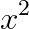
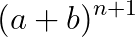

# AutoLaTeXImageConverter

**Version:** 1.0.1
**Platform:** [BetterDiscord](https://betterdiscord.app/)

AutoLaTeXImageConverter watches your outgoing messages for inline math—fractions, exponents, square roots, Greek letters, and parenthesized expressions—and replaces them with a link to a LaTeX-rendered PNG (white text on transparent background) from CodeCogs. No more manual screenshots or bot commands: just type `1/2`, `(x-5)/(x-4)`, `alpha^2`, `sqrt(9)`, etc., and the plugin sends the rendered image automatically.

## Features

- **Fractions & Grouping**  
  - `3/4` → `\frac{3}{4}`  
  - `(x-5)/(x-4)` → `\frac{(x-5)}{(x-4)}`

- **Exponents**  
  - `x^2`, `(a+b)^(n+1)` → `x^{2}`, `(a+b)^{n+1}`

- **Square Roots**  
  - `sqrt(2)` → `\sqrt{2}`

- **Greek Letters**  
  - `pi` → `\pi`, `theta` → `\theta`, etc.

- **White Text**  
  Renders your math in white for maximum contrast over chat backgrounds.

- **URL-Safe**  
  Generates `https://latex.codecogs.com/png.latex?...` links that Discord will automatically embed.

## Visual Examples

- **Fraction rendering** (`3/4`):  
  

- **Grouped Fraction rendering** (`(x-5)/(x-4)`):  
  

- **Exponent rendering** (`x^2`):  
  

- **Grouped Exponent rendering** (`(a+b)^(n+1)`):  
  

- **Square Root rendering** (`sqrt(2)`):  
  

- **Greek Letter rendering** (`pi`):  
  

## Installation

1. **Install BetterDiscord** (if you haven’t already)  
   - Download from [https://betterdiscord.app/](https://betterdiscord.app/)  
   - Follow the official instructions for your platform.

2. **Download the plugin**  
   - Save `AutoLaTeXImageConverter.plugin.js` to your BetterDiscord `plugins/` folder.

3. **Install ZeresPluginLibrary**  
   - Download `0PluginLibrary.plugin.js` from the [BDPluginLibrary releases](https://github.com/rauenzi/BDPluginLibrary/releases).  
   - Place it in the same `plugins/` folder.

4. **Enable the plugin**  
   - Go to **User Settings → Plugins**, then toggle on **AutoLaTeXImageConverter**.
